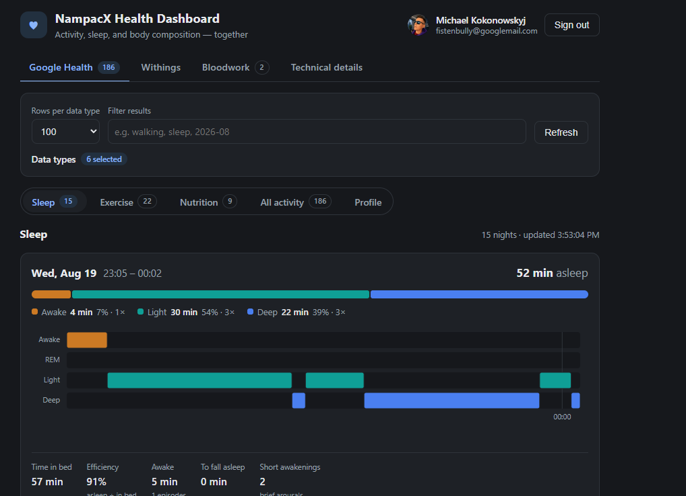
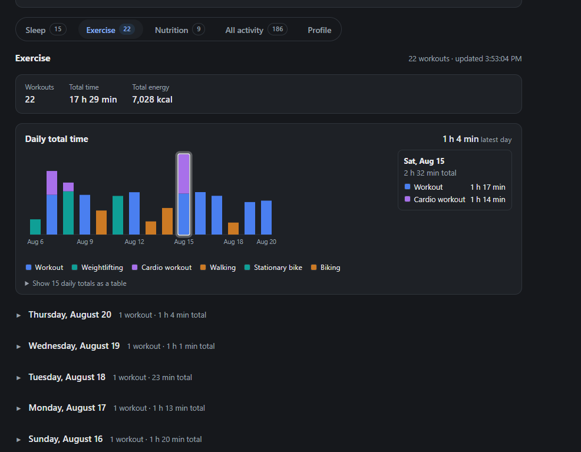
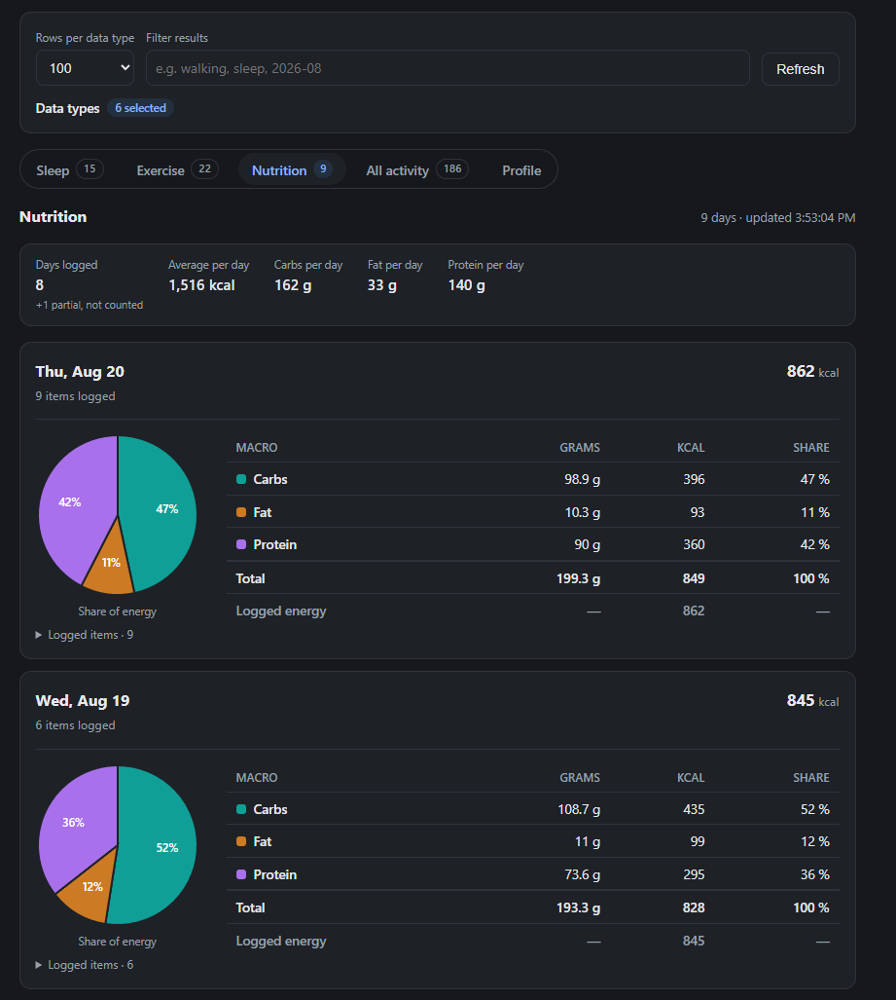
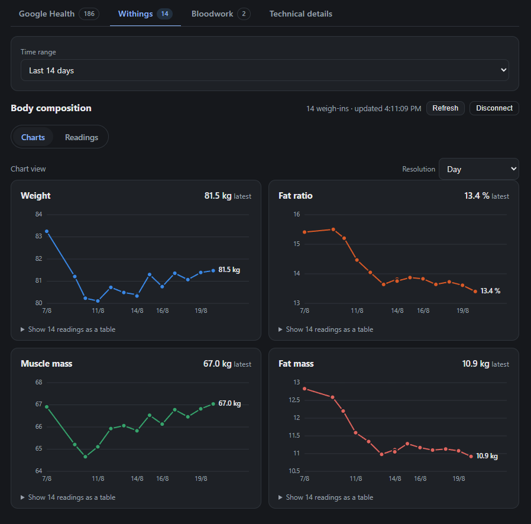
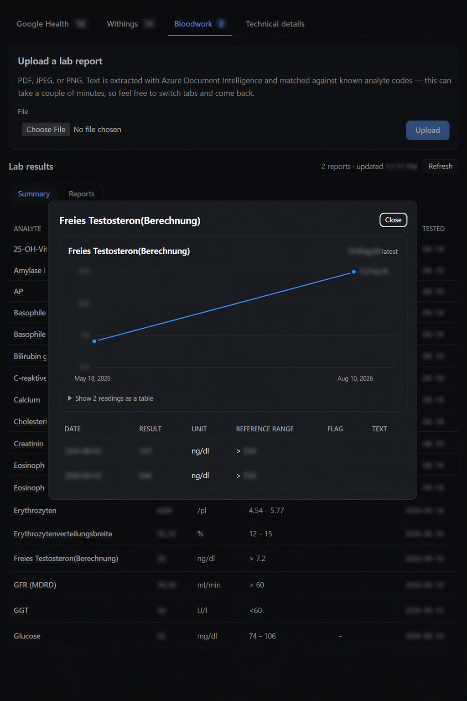

# 🩺 NampacX Health Dashboard

A little React + Vite dashboard that shows you your own health data — activity, sleep stages,
body-composition weigh-ins, and bloodwork — in one place. 📊

**Two providers, completely independent.** Connect [Google Health](https://developers.google.com/health/about),
connect [Withings](https://developer.withings.com/developer-guide/v3/integration-guide/public-health-data-api/public-health-data-api-overview),
or connect both. Neither needs the other.

There's also an optional **Bloodwork** tab: upload a lab-report PDF or scan and it gets parsed and
tracked over time. It isn't a third provider — it rides on the same Google sign-in rather than adding
its own OAuth flow — so it's covered separately below rather than in the provider comparisons.

---

## 🤔 Why this exists

> I was annoyed that Claude could not connect with my Google Health app, and also not with the
> measurements from my Withings BodyFit. So the idea arose to build a web dashboard which at least
> lets me look at the data they both collect.
>
> Work is still **WIP** and there are a lot of things to add and change — **but it works.** ✅

---

## ✨ What you get

Four tabs:

| Tab | What's in it |
| --- | --- |
| 🏃 **Google Health** | Five views, sharing one data-type picker and time range (Profile has no time range to apply):<br>😴 **Sleep** — a proper stage timeline per night (awake / REM / light / deep), composition bar, time in bed, efficiency, short awakenings, plus HRV and heart rate *while you were asleep*.<br>💪 **Exercise** — a card per workout with its most interesting numbers surfaced first, and totals for the window.<br>🍎 **Nutrition** — a macro pie and totals per logged day, with derived and logged energy shown side by side.<br>📋 **All activity** — steps, distance, floors, active minutes, calories and everything else you've selected, grouped by day, newest first.<br>🙍 **Profile** — age, stride lengths, membership start date. |
| ⚖️ **Withings** | Weight and fat-ratio charts over time, and a card per weigh-in with the change since the last one. |
| 🩸 **Bloodwork** | Upload a lab-report PDF or photo and it's parsed automatically. Two views: **Summary** — one row per analyte with only its latest value and a *Last tested* date, click a row for a trend chart plus the full history table behind it; **Reports** — every value from every upload, grouped by report date, with inline correction for anything the parser got wrong. |
| 🔧 **Technical details** | Raw fetch outcomes, token state, the boring-but-useful debugging view. |

> 💡 **Sleep Score and Readiness aren't here** — and can't be. Google doesn't expose them through the
> API at all; they're computed inside the Google Health app and on the watch. Everything above is
> built from fields the API actually returns.

<table>
<tr>
<td width="50%">

**😴 Sleep**


</td>
<td width="50%">

**💪 Exercise**


</td>
</tr>
<tr>
<td width="50%">

**🍎 Nutrition**


</td>
<td width="50%">

**⚖️ Withings**


</td>
</tr>
<tr>
<td width="50%">

**🩸 Bloodwork** — the Summary table (blurred here, since it's real data) with the analyte detail
dialog open, showing its trend chart and full history table


</td>
<td width="50%"></td>
</tr>
</table>

---

## 🚀 Fork it and deploy

There are three levels here. **Level 1 is the easy one**, and it's genuinely enough — you get the
whole Google Health side, including all the sleep stuff, with no backend, no cloud bill, and no Azure
account. Levels 2 and 3 only exist because Withings and Bloodwork each need a server. 🙃

### 🟢 Level 1 — Google Health only (~10 minutes, free)

No backend. No secrets. Just static files on GitHub Pages.

**1. Fork this repo** 🍴

**2. Find out your Pages URL first** — you'll need it in step 3, and it's the #1 thing people get
wrong. Go to **Settings → Pages**, set **Source: GitHub Actions**, and note the URL it shows you.

> ⚠️ If your GitHub account has a custom domain configured, project sites are served from *that*, not
> from `<you>.github.io`. Believe the Settings page, not your assumptions.

While you're there: turn on **Enforce HTTPS**. Google refuses `http://` origins for anything except
localhost, so sign-in simply won't work otherwise.

**3. Set up Google Cloud** ☁️

1. Create or pick a project, then enable the
   [Google Health API](https://console.developers.google.com/apis/library/health.googleapis.com).
2. Configure the **OAuth consent screen** — publishing status *Testing* is fine.
3. On **Data access**, click *Add or remove scopes* and add the `googlehealth.*.readonly` scopes.
4. On **Audience**, add your own Google account under *Test users*. 👈 easy to forget
5. **Credentials → Create credentials → OAuth client ID → Web application.** Under **Authorized
   JavaScript origins**, add:
   - `http://localhost:5173` (for local dev)
   - your Pages origin from step 2 — **scheme and host only**, no repo path

   Copy the client ID. ✂️

**4. Tell your fork about it** 🔑

**Settings → Secrets and variables → Actions → Variables** → *New repository variable*:

| Name | Value |
| --- | --- |
| `VITE_GOOGLE_CLIENT_ID` | the client ID from step 3 |

A **variable**, not a secret — an OAuth client ID is public by design and ships in the bundle either
way. The build fails with a clear message if it's missing, rather than deploying a site nobody can
sign in to.

**5. Deploy** 🎉

Push anything to `main`, or go to **Actions → Deploy to GitHub Pages → Run workflow**. That's it.

<details>
<summary>😬 Something went wrong?</summary>

| Symptom | Fix |
| --- | --- |
| `origin_mismatch` at sign-in | The origin in Google Cloud doesn't match what Pages actually serves. Check **Settings → Pages** for the real one — host only, no path. |
| Build fails on `VITE_GOOGLE_CLIENT_ID` | The repo variable isn't set, or was added as a *secret* instead of a *variable*. |
| Deploy job fails immediately | **Settings → Pages → Source** isn't set to *GitHub Actions*. The workflow can't enable Pages for you. |
| Signed in, but no data | Your Google account isn't in *Test users*, or the scopes weren't added on the **Data access** page. |
| Sleep tab is empty | Sleep stages need a watch or band that tracks them, and the data has to have synced to Google first. |

</details>

### 🔵 Level 2 — add Withings (needs an Azure subscription)

Withings' token endpoint demands a `client_secret` for the code exchange **and** every refresh, and a
static site can't hold a secret. So [`broker/`](broker/) exists: a tiny stateless Azure Function that
does nothing but swap tokens. It scales to zero, so it costs approximately nothing when idle. 💤

Everything else — actually fetching your measurements — still happens straight from the browser.

**1. Register a Withings app** at the [Partner dashboard](https://developer.withings.com/dashboard/).
The callback URI must match your deployed URL **byte-for-byte, trailing slash included**, and must be
HTTPS. Note the client ID and secret.

> 🧪 Want a second one for local dev? You'll need it — Withings won't accept a plain `localhost`
> callback, so register a separate app with `https://localhost:5173/` and use something like
> `@vitejs/plugin-basic-ssl` locally.

**2. Let GitHub talk to Azure.** There's a script for this, so you don't have to click through the
portal:

```powershell
./scripts/bootstrap-github-oidc.ps1 -WhatIf   # dry run, shows every change
./scripts/bootstrap-github-oidc.ps1           # do it for real
```

It creates the app registration and service principal, wires up the federated credentials, assigns
the roles, and writes the `AZURE_*` secrets into your repo. You'll need the
[Azure CLI](https://learn.microsoft.com/cli/azure/install-azure-cli) and
[`gh`](https://cli.github.com/) logged in.

**3. Add the rest of the config** under **Settings → Secrets and variables → Actions**:

📋 **Variables:**

| Name | Example |
| --- | --- |
| `AZURE_LOCATION` | `westeurope` |
| `WITHINGS_CLIENT_ID` | from step 1 |
| `WITHINGS_ALLOWED_ORIGINS` | your Pages origin |
| `WITHINGS_ALLOWED_REDIRECT_URIS` | your callback URI, exactly as registered |
| `VITE_WITHINGS_CLIENT_ID` | same as `WITHINGS_CLIENT_ID` |
| `VITE_WITHINGS_BROKER_URL` | filled in after step 4 |

🔒 **Secrets:**

| Name | |
| --- | --- |
| `WITHINGS_CLIENT_SECRET` | from step 1 — the one genuinely secret value in the whole project |

**4. Deploy the broker.** Push anything touching `broker/`, `infra/` or `azure.yaml`, or run the
**Deploy Withings token broker** workflow by hand. Then grab the Function's URL and set
`VITE_WITHINGS_BROKER_URL` to `https://<your-function-app>.azurewebsites.net/api` (no trailing
slash), and re-run the Pages workflow.

You can also do it from your own machine with [`azd`](https://aka.ms/azd): `azd up`.

**5. Click Connect Withings.** 🎊

> 🧑‍🔬 **No scale? No problem.** Set `VITE_WITHINGS_DEMO=1` to exercise the whole flow against
> Withings' demo account.

📖 More detail, including the error contract the SPA depends on: [broker/README.md](broker/README.md).

### 🟣 Level 3 — add Bloodwork tracking (needs Level 2 done first)

Bloodwork reuses the Google sign-in you already have — no separate OAuth app to register — but
parsing a PDF needs a real backend, so it shares [`broker/`](broker/)'s Azure setup (same
`infra/main.bicep`, same `azd up`, same deploy workflow) plus an
[Azure AI Document Intelligence](https://azure.microsoft.com/products/ai-services/ai-document-intelligence)
resource for the actual layout extraction.

**1. Do Level 2 first.** Bloodwork is provisioned by the same template as the broker, so you need the
Azure OIDC login from Level 2's step 2 regardless of whether you actually want Withings.

**2. Add two more repository variables** under **Settings → Secrets and variables → Actions →
Variables**:

| Name | Value |
| --- | --- |
| `GOOGLE_CLIENT_ID` | same value as `VITE_GOOGLE_CLIENT_ID` — the *backend* checks the `aud` claim on every request against this, separately from the SPA build |
| `BLOODWORK_ALLOWED_ORIGINS` | your Pages origin, same as `WITHINGS_ALLOWED_ORIGINS` |

**3. Deploy.** The same push-to-`main` (or manual **Deploy Azure Functions** run) from Level 2
provisions the Document Intelligence resource and the bloodwork Function App together with the
broker — there's nothing extra to trigger. Grab the bloodwork Function's URL from the deploy output
and set:

| Name | Value |
| --- | --- |
| `VITE_BLOODWORK_API_URL` | `https://<your-bloodwork-function-app>.azurewebsites.net/api`, no trailing slash |

**4. Upload a lab report.** 🩸 Sign in, open the Bloodwork tab, upload a PDF or photo. It's queued
and parsed asynchronously (usually a few seconds), then shows up in both **Reports** and **Summary**.

> 💰 Document Intelligence's prebuilt layout model deploys at the `S0` tier and bills per page
> analyzed — nothing like the broker's scale-to-zero-and-forget-it cost profile. Fine for personal
> use, worth knowing about before you upload a stack of reports.

📖 More detail — the routes, the async upload pipeline, local dev with Azurite:
[bloodwork/README.md](bloodwork/README.md).

---

## 💻 Run it locally

You'll need **Node 20.19+ or 22.12+** (Vite 7 insists).

```bash
npm install
cp .env.example .env.local   # paste your client ID in
npm run dev
```

Open <http://localhost:5173> and hit **Sign in with Google**. ✨

Withings and Bloodwork are optional here too — leave their blocks in `.env.local` blank and those
tabs just show a "connect" / "not configured" prompt.

```bash
npm run typecheck   # strict TS
npm run test        # vitest
npm run build       # production build
npm run preview     # serve the build
```

The broker is its own little npm project:

```bash
cd broker && npm install && npm test
cd broker && npm start   # http://localhost:7071
```

Bloodwork is a .NET project and needs [Azurite](https://learn.microsoft.com/azure/storage/common/storage-use-azurite)
for its queue trigger — see [bloodwork/README.md](bloodwork/README.md) for the full local setup:

```bash
cd bloodwork && dotnet build && dotnet test
cd bloodwork && func start --port 7072   # 7071 is broker's
```

> 🧪 Tests are Vitest with **no jsdom** — everything under test is pure logic (normalization, token
> rotation, OAuth state, chart geometry). A DOM harness would be more setup than these components
> earn.

---

## ⚖️ What each provider actually needs

The two sides share nothing but the page they render on.

| | 🏃 **Google Health** | ⚖️ **Withings** |
| --- | --- | --- |
| Backend | **None** — the browser calls the API directly | An Azure Function ([`broker/`](broker/)) |
| Client secret | **None** 🎉 | **Required**, held only by the broker |
| Azure subscription | Not needed | Needed |
| Registration wants | a JavaScript **origin** | a redirect **URI**, byte-for-byte, HTTPS only |
| Token lifetime | dies with the tab | ~1 year, rotates on every use |
| If you skip it | Withings still works alone | Google still works alone |

Missing Google config **fails** the build — a site nobody can sign into isn't worth shipping. Missing
Withings config only logs a warning and deploys Google-only. That asymmetry is on purpose. 🙂

---

## 🗺️ How it's put together

Both providers flow the same way: **auth → fetch → normalize → render**, and never touch each other.
Bloodwork adds one more step at the front (**upload → parse**) but reuses Google's auth rather than
inventing its own.

| Where | What it does |
| --- | --- |
| [src/auth/google/](src/auth/google/) | Google Identity Services token client, session in `sessionStorage` |
| [src/api/google/dataTypes.ts](src/api/google/dataTypes.ts) | The catalog of readable data types and their scopes |
| [src/api/google/healthApi.ts](src/api/google/healthApi.ts) | REST calls, error mapping, bounded-concurrency fan-out |
| [src/api/google/normalize.ts](src/api/google/normalize.ts) | Raw data point → renderable row, structurally |
| [src/api/google/sleep.ts](src/api/google/sleep.ts) | Sleep stages, the one place that *doesn't* go through normalize |
| [src/charts/](src/charts/) | Hand-rolled SVG charts — no charting dependency |
| [src/auth/withings/](src/auth/withings/) | Authorize redirect, broker calls, token rotation safety |
| [src/api/withings/](src/api/withings/) | `getmeas` client and measure normalization |
| [broker/](broker/) | The Azure Function that holds the Withings secret |
| [src/state/bloodworkData.tsx](src/state/bloodworkData.tsx) | Upload, job polling, results and corrections — reuses the Google access token, no separate auth |
| [src/api/bloodwork/summary.ts](src/api/bloodwork/summary.ts) | Every report → one row per analyte, latest value only |
| [src/api/bloodwork/analyteHistory.ts](src/api/bloodwork/analyteHistory.ts) | One analyte → its full history, for the detail chart and table |
| [bloodwork/](bloodwork/) | The Azure Function that runs Document Intelligence and stores results |

---

## 🤓 The interesting bits

Things that took a while to work out, kept here so the next person doesn't have to.

<details>
<summary>🌐 Why there's no proxy for Google</summary>

`health.googleapis.com` returns permissive CORS headers — it echoes `Access-Control-Allow-Origin`
for arbitrary origins and allows the `authorization` header. See for yourself:

```bash
curl -sS -o /dev/null -D - -X OPTIONS \
  https://health.googleapis.com/v4/users/me/dataTypes/steps/dataPoints \
  -H 'Origin: https://example.com' \
  -H 'Access-Control-Request-Method: GET' \
  -H 'Access-Control-Request-Headers: authorization'
```

So the browser calls the API directly and the whole app ships as static files. There's no API-base
override anywhere, because there's nothing to point it at.

An earlier version of this repo had a dev proxy. It was never needed and has been removed.

</details>

<details>
<summary>🔍 How unknown data types still render</summary>

Google documents the payload of only a handful of data types, and the fields differ per type. So
`normalize.ts` works **structurally** rather than per-type: find the payload, search known timestamp
paths, flatten what's left into label/value chips, and infer units from field-name suffixes
(`caloriesKcal`, `distanceMillimiters`, `durationMillis`).

Each data type can also declare `summaryKeys` — hints about which field to lead with. They're only
hints: if none match, the generic "first numeric leaf" rule still applies, so a bad guess degrades
the headline instead of breaking the row. Anything not understood is still there under **Raw JSON**.

The time filter is applied optimistically too — if the API rejects it with a 400 for a type that has
no such field, the request is retried unfiltered so that type still contributes rows.

</details>

<details>
<summary>😴 Why sleep gets its own parser (and a lesson)</summary>

`stages` is an array of objects, and the generic flattener collapses those to `"23 entries"`. You
can't recover a stage timeline from that, so sleep has a typed parser and `normalize.ts` is left
alone.

**The lesson:** the first version of that parser was written from the RPC reference on
developers.google.com — and every single field name there differs from what the REST API actually
sends (`stages[].type: "DEEP"`, not `sleep_stages[].stage_type: "SLEEP_STAGE_DEEP"`). Every read
missed, every night rendered "0 min asleep", and the tests passed the whole time because they were
built from the same wrong names.

There's now a real captured payload in `sleepNight.fixture.ts` that the tests assert against. If you
add a field: **get a real payload first.** 📸

Also: timestamps carry a `startUtcOffset`, and it matters. A `20:18Z` bedtime is 22:18 at +02:00 —
formatting the instant in the browser's timezone only accidentally works while you're sitting in the
same offset your watch was.

</details>

<details>
<summary>🔄 The Withings refresh token is scary and here's why</summary>

It's a **~1-year credential that rotates on every use** — Withings kills the old one the instant a
new one is issued. Lose the new one mid-flight and the link is permanently dead.

So [`withingsTokenStore.ts`](src/auth/withings/withingsTokenStore.ts) exists almost entirely to make
that safe: writes are synchronous the moment a broker response parses, both `{current, previous}`
are kept, and refreshes are single-flighted in-tab and cross-tab (via a Web Lock where supported).

**Only a broker `401 invalid_grant` ever clears the stored token.** A network blip or a broker `5xx`
must never look the same, or a flaky connection would silently and permanently break the link.

It also defaults to `sessionStorage`; `localStorage` is opt-in behind an explicit "keep me connected"
checkbox, because a year-long credential in `localStorage` is a much bigger XSS blast radius.

</details>

<details>
<summary>🩸 Bloodwork's identity problem: three names for the same thing</summary>

A lab report row carries `analyse` (the lab's own code for the test), `bezeichnung` (its
human-readable label), and a Table Storage `rowKey` (a sanitized, deduped version of `analyse`, used
for corrections). All three look interchangeable and aren't:

- The **Summary** and detail-history views group by `analyse` — it's the stable identity across
  reports. `bezeichnung` is display text a lab can phrase slightly differently between visits, so
  grouping by it would silently split one analyte's history into two.
- Every table **displays** `bezeichnung || analyse` — the code alone is a poor headline.
- **Corrections** go by `rowKey`, not `analyse`, because `rowKey` is what actually survived Table
  Storage's character restrictions and per-report deduping; two rows can share an `analyse` after
  sanitizing collapses them, and only `rowKey` still tells them apart.

(And the header says "Analyte", not "Analyse" — that's not a typo. It's the correct English term for
what's being measured; `analyse` only survives as a *field name* because it mirrors the German lab
report's own column, the same way `bezeichnung` does.)

Result values are also German-formatted decimals (`"4,70"`, comma not dot) while reference ranges in
the same document use a dot (`"3.5 - 5.1"`) — an OCR/layout quirk of the source reports, not
inconsistency in this codebase. `analyteHistory.ts`'s `parseAnalyteValue` normalizes the comma before
parsing a chart point; get it backwards and `"4,70"` silently becomes `4`, not `4.7`.

</details>

<details>
<summary>🕵️ Withings reports everything as the same error</summary>

A wrong `client_secret`, a dead refresh token, a bad code — Withings answers all of them with the
same generic "Invalid Params" status. The broker separates them by matching the one wording Withings
seems to reserve for credential problems ("invalid client id/secret").

It's a heuristic, not a documented contract. The evidence and reasoning are in
[broker/src/lib/withings.ts](broker/src/lib/withings.ts). This matters because the SPA decides
whether to *keep or destroy* your refresh token based on that answer.

</details>

<details>
<summary>📝 Odds and ends</summary>

- Only data types with a `.readonly` scope are listed. `moods`, `symptoms`, `menstrual-period` and
  `ovulation-test` are write-only, so they can't be read back.
- The Google access token lives in `sessionStorage` and dies with the tab. There's no refresh token
  — by design, since that would need a client secret and a backend.
- While the consent screen is in *Testing*, only listed test users can sign in (max 100). Going
  beyond that needs a third-party security review.
- The Pages base path is handled automatically: `configure-pages` emits `base_path` → the workflow
  passes `VITE_BASE_PATH` → `vite.config.ts` normalizes it into Vite's `base`. Local builds default
  to `/`.

</details>

---

## 🚧 Status

WIP, and honest about it. Plenty left to add and change — but it works, and it's read-only, so the
worst it can do is show you a number you didn't like. 😄

Data from the [Google Health API](https://developers.google.com/health/about), the
[Withings API](https://developer.withings.com/developer-guide/v3/integration-guide/public-health-data-api/public-health-data-api-overview),
and lab reports you upload yourself, parsed by
[Azure AI Document Intelligence](https://azure.microsoft.com/products/ai-services/ai-document-intelligence).
